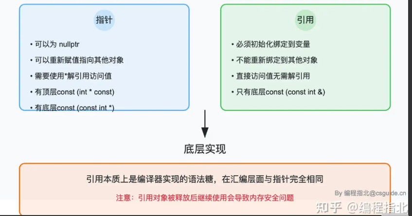
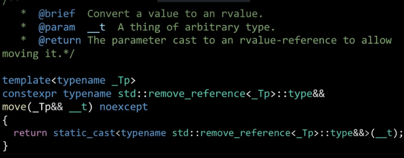
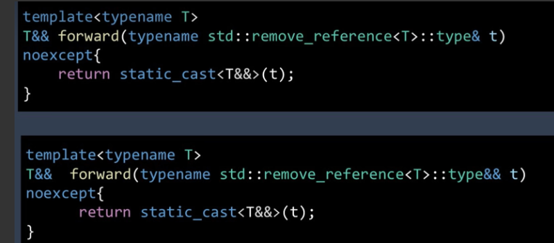
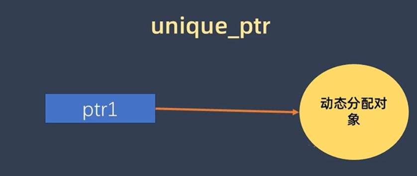
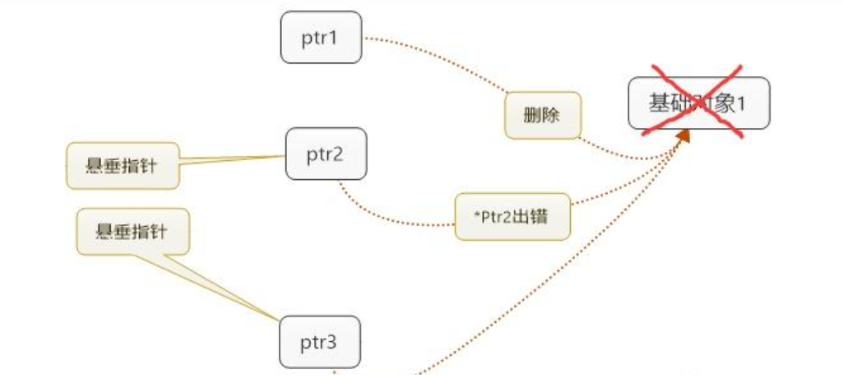
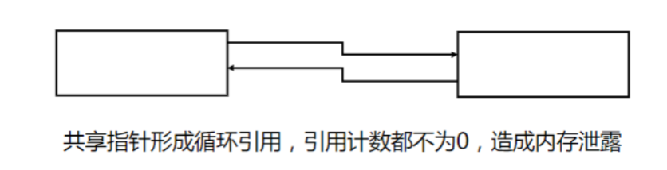
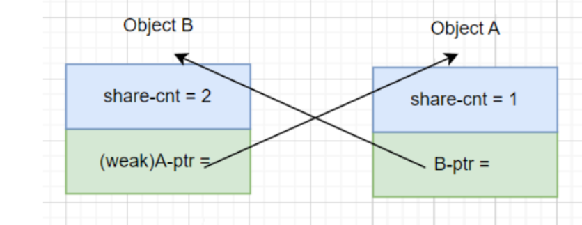
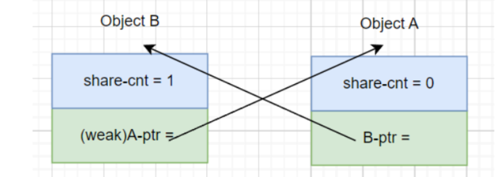
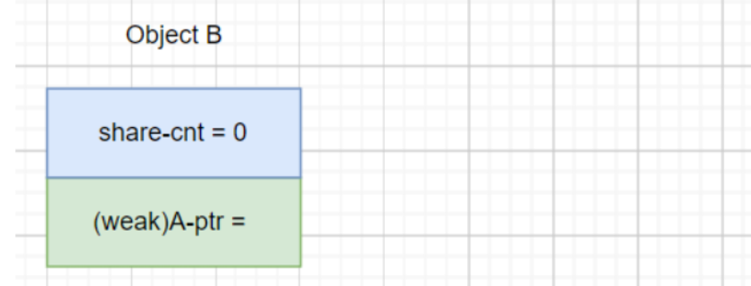

# Project 2: $\mathrm{Smart Pointer}$

> SJTU CS1958-01 2025Fall 第二次大作业

为行文方便，对计算机底层与实际的编译过程作了简化，本文仅用于理解，切勿过分严格推敲

# 什么是指针？

我们不妨先从内存说起，什么是内存？

> 内存就是计算机的存储空间，用于存储程序的指令、数据和状态。在 C 语言中，内存被组织成一系列的字节，每个字节都有一个唯一的地址。程序中的变量和数据结构存储在这些字节中。

正因为有了内存，才有了变量。程序中各种各样的变量，本质上就是向计算机申请了不同的内存来存放，内存中不同变量的生命周期造就了许多特殊的语言现象，譬如：

*  全局变量与静态变量之所以可以全程被使用是因为其被存放在全局/静态存储区，这个区域的内存在程序的生命周期几乎都是全局的，到整个程序运行完毕才会被释放
> 
*   函数体内部的局部变量之所以在离开函数体后无效是因为函数调用时的局部变量、函数参数以及返回地址均被储存在栈空间，函数调用完成后，分配给这个函数的空间会按照类似于栈的顺序被释放。
>  
*  当使用`new`（C++）或者`malloc`（C）分配内存时，被分配动态内存的区域，分配的内存块就位于堆区，堆空间不会跟栈空间一样手动释放内存，我们需要手动释放这些内存，否则可能导致内存泄漏。

我们已经知道了变量被放在了某个内存块里，如果我们要想知道变量到底放在哪里，可以通过运算符&来取得变量实际的地址，这个值就是变量所占内存块的起始地址。那么我们能不能用一个新的变量来保存这个变量的内存地址呢？这就是指针.

比如以下语句:

``` 
int a = 3;
int* p = &a;
```

这里的a就代表了一块内存区域，用于存放整数3；而指针p用来保存那块保存a的指针的内存块地址。

说到底，为什么我们需要指针？直接用变量名不行吗？当然可以，但是变量名是有局限的。变量名的本质是变量地址的符号化，变量是为了让我们编程时更加方便，对人友好，可计算机可不认识什么变量 a，它只知道地址和指令。所以当你去查看 C 语言编译后的汇编代码，就会发现变量名消失了，取而代之的是一串串抽象的地址。你可以认为，编译器会自动维护一个映射，将我们程序中的变量名转换为变量所对应的地址，然后再对这个地址去进行读写。

# 什么是引用?

在一般的C语言教科书上，通常会这样引入引用：

> ```
> void fun(int* x){
>     *x = 20;
> }
> ```
> 
> 在很多传入指针的场合，频繁的`int*`和`*p`令人焦头烂额，如何这里还出现了多级指针那简直更是让人错误频发，所以我们采用了引用来简化书写:
> 
> ```
> void fun1(int& y){
>     y = 30;
> }
> ```

这事实上表现了引用和指针存在着某种意义的等价，假使我们用引用的语言改写上面指针那一节的例子，有：

```
int a = 3;
int& b = a;
```

正如前文所说，a 代表了一块内存区域，用于存放整数3；而与指针不同的是，b不代表存储a的地址的变量，b 代表了同一块内存区域，是同一块内存区域的不同表述形式。

在常见的表述里，会把**引用**称之为变量的**别名**，因为引用和值有一样的语义，而指针不是。比如加减号、赋值操作符，作用在引用上会触发对象的操作符重载，但作用在指针上不会；但从本质上看，引用的表现更像是一个常量指针，它非空，在初始化后不能被更改，这直接导致了不存在引用的指针，因为引用不能更改所引用的对象。除此之外，引用与指针看起来最大的不同点无非在于引用与原变量共享内存地址以及无需解引用就可以获取或修改其指向变量的值。

事实上，引用与指针在**汇编**层面**没有区别**，你可以理解为，引用只是C++编译器对一个常量指针作了一些封装，使得其可以自动完成取地址、解引用的功能,上文中引用区别于指针的特性都是编译器约束完成的，一旦编译成汇编就和指针一样。由于引用只是指针包装了下，所以也存在风险，比如如下代码:

```
int *a = new int;
int &b = *a;
delete a;
b = 12;
// 对已经释放的内存解引用
```
所以由编译器保证初始化的引用相较于指针而言使用起来较为方便(如不用检查空指针等)，所以建议尽量用引用代替指针。
    


# 什么是左值与右值?

在一开始的论述中，我们似乎默认了一件事情，即所有的变量都存储在了某个内存块里，我们可以通过对内存块地址的修改达成对存储变量修改的目的。但这句话不总是正确的。

正如我们知道 :

```
int a = 5;
int* p = &a;
```

是合法的，而`int* p = &5;`是不合法的。

仔细想想这个事情，当`a=5;`在内存中运行时,a 和5必然都是有其所对应的地址的，然而我们可以提取出a的地址却不能提取5的地址，这指向一种可能：似乎有些变量/表达式，他们只是计算过程中的临时变量，操作完就销毁了，我们没有办法通过提取地址的方式对它们进行修改。在目前，我们可以粗浅的将那些能否取得这个表达式的地址或者引用的判准将表达式分为两类，即左值与右值。

我们不妨来看一些例子来加强对这个问题的理解：

```
int c = 5;
int* p = &c;
```

在这个例子里面, &c 可以被定义，这意味着c是一个左值，在很多教科书里，`lvalue` 有一个最符合表面含义的意思，便是，左值大多数指的是可以被用在赋值语句左侧的表达式，这也符合我们的认知，譬如```a = 5;```司空见惯但```5 = a;```就会被编译器报错一样。我们再来看一个例子:

```const int a;```

这里的`a`看起来是右值，因为常量不可被赋值。但这是对的吗？我们不妨采用取出`a`的地址:

```const int &b = a; ```

如果你跑这个程序的话，可以发现这是可以正常运行的，这说明`a`是个左值，只不过是个不可修改的左值。

我们再来看几个关于右值的例子:

```int b = &4;``` 
```int& b = 4;```

因为4是右值，不论是取地址还是对左值取引用，这样的操作都是不合法的。

```
a = m + n; 
a = -m
int b[5];
``` 

在这几个例子里，`m+n` 和`-m` 都是运算中的中间变量，在临时变量处理后迅速销毁；而数组的这个例子比较有趣，`b`是不可修改的左值，而数组中的具体元素譬如`b[1]`也是左值，而数组是右值。

我们同样可以给出很多关于左值和右值的例子，事实上，类的成员变量和返回引用的函数是左值，由于函数指针的存在，所有的函数都是左值，指针与引用也理所当然的是左值；而那些非静态成员函数，数组，`this`指针,`lambda`表达式，内置运算符的表达式都是右值。

一句话，判定左值和右值的最根本判据就是能否取得这个表达式的地址或者引用。事实上，左值是那些存储单元所存储的值，他们的生命周期往往较长，所以能够提取；而右值是那些寄存器存储的值或者立即值，他们往往被当做临时变量处理后就销毁了，所以无法取得。

结合前面的前置知识，我们可以很好的理解左值引用，也就是一般的引用是什么东西，譬如如果写下：

```
int a = 5;
int& b = a;
```
你会觉得这十分理所当然；然而，新版C++支持一类名为右值引用的特性，它支持对右值的引用使得以下式子变得合法:

```
int&& a = 5;
```

WTF？在前文我们不是已经说右值不具备较长的生命周期了吗？为什么可以对它取引用？以及这个东西又有什么用？

# 什么是右值引用,`std::move`，`std::forward`？

我们来看一个例子：

> 假设你现在是一名程序员，你想要实现一个类的拷贝构造函数，而这个拷贝构造函数的传入参数又是一个数组(以`std::vector`为例)的时候，你通常会采取以下的写法：
> 
> ```
> T f(std::vector<T> data)
> ```
> 
> 但是你转念一想，在这个过程中，你等价于把你传进去的参数又拷贝了一次，这样的开销太大了，你想到了刚刚学过的引用，灵机一动，又为了避免函数修改你的`std::vector`,你把这个代码修改成:
> 
> ```
> T f(const std::vector<T>& data) 
> ```
> 看起来天衣无缝，你很满意，抱着这样的信念，你手写了一个数组类：
> 
> ```
> class Array {
> public:
>     Array(int size) : size_(size) {
>         ...
>     }
>      
>     // 深拷贝构造
>     Array(const Array& temp_array) {
>         size_ = temp_array.size_;
>         data_ = new int[size_];
>         for (int i = 0; i < size_; i ++) {
>             data_[i] = temp_array.data_[i];
>         }
>     }
>      
>     // 深拷贝赋值
>     Array& operator=(const Array& temp_array) {
>         delete[] data_;
>         size_ = temp_array.size_;
>         data_ = new int[size_];
>         for (int i = 0; i < size_; i ++) {
>             data_[i] = temp_array.data_[i];
>         }
>     }  
>  
>     ~Array() {
>         ...
>     }
>  
> public:
>     int* data_;
>     int size_;
> };
> ```
> 
> 你突然发现，虽然这个类的拷贝构造函数、赋值运算符重载函数已经通过使用左值引用传参来避免一次多余拷贝了，但是内部实现要深拷贝，无法避免。 这时，有人提出一个想法：是不是可以提供一个**移动构造函数**，把被拷贝者的数据移动过来，被拷贝者后边就不要了，这样就可以避免深拷贝了，比如：
> 
> ```
> class Array {
> public:
>     Array(int size) : size_(size) {
>         data = new int[size_];
>     }
>      
>     // 深拷贝构造
>     Array(const Array& temp_array) {
>         ...
>     }
>      
>     // 深拷贝赋值
>     Array& operator=(const Array& temp_array) {
>         ...
>     }
>  
>     // 移动构造函数，可以浅拷贝
>     Array(const Array& temp_array, bool move) {
>         data_ = temp_array.data_;
>         size_ = temp_array.size_;
>         temp_array.data_ = nullptr;
>     }
>      
>  
>     ~Array() {
>         delete [] data_;
>     }
>  
> public:
>     int* data_;
>     int size_;
> };
> ```
> 
> 作为一名身经百战的程序员，你自然发现这个类有两个显而易见的缺点：
> 
> * 需要一个额外的参数来区分移动与拷贝的语义
> 
> * 这个程序根本不可能运行!既然`temp_array`在函数体内进行了修改，所以它不能是个`const`左值引用；但如果函数参数改成非`const`，那么像Array的默认构造函数Array()作为右值就传不进这个函数了
> 
> 为了解决这个问题，C++开发了一个名叫右值引用的东西，在上述的问题里，你只需要将代码修改成右值引用版本，此时传入的是右值，而函数体内部的右值引用本身又是个左值，这样就可以用来解决上面的问题了。
> 
> ```
> class Array {
> public:
>     ......
>     Array(Array&& temp_array) {
>         data_ = temp_array.data_;
>         size_ = temp_array.size_;
>         temp_array.data_ = nullptr;
>     }
>  
> public:
>     int *data_;
>     int size_;
> };
> ```
> 
> ```
> int main(){
>     Array a;
>      
>     // 左值a，用std::move转化为右值
>     Array b(std::move(a));
> }
> ```

事实上，这类情况是普遍存在的，假如你把一个类的默认构造函数传进类，但它一旦传进函数，就不支持左值相关运算，可是它在函数体内必须是左值；这显然是矛盾的。
    
为了打补丁，C++开发了一个名叫右值引用的东西，它的核心思想是延长了临时值的生命周期，并且允许我们修改其值，本身并不对原对象做任何操作，只是给使用者指明“这是个右值”，可以被移动。或许初学者会对移动和右值的相关性有所迷惑，但略加思考后便可想到，所有应该被移动的值，都是右值！

事实上这一点完全不值得意外。回顾左右值的定义就知道，右值本身不具有地址，如果不被使用，它将会立刻消亡——这本身就带有临时变量的含义。例如某个函数 `f()`的返回值、直接构造的对象 `A()`，这些表达式如果我们不立即使用它，当前语句过后就会消亡。既然它们是这样的临时变量，那么使用时就应当用移动语义来直接占有原本将会消亡的表达式内容，而非拷贝。你当然可以通过左值的形式来实现，但既然已经有了更优的方式，那何乐而不为呢？

但俗话说的好：福无双至，祸不单行。虽然移动与拷贝并不局限于左右值，但我想要对一个左值进行移动时，我传入的参数需要是一个右值，于是我便需要一个将左值转换为右值的工具，那便是`std::move`。



可能这看起来比较奇怪，但是看了STL源代码后平平无奇。容易看出，实际上`move()`所做的全部工作，不过是返回了通过 `static_cast`直接转型为右值引用后的实参。而 `static_cast`作为关键字，能够神奇的对表达式进行类型转换，而不创造新对象——相当于，在原对象上创造了一个新的使用视图，然后返回这个视图.
    
这告诉我们，值类型只是一种语法标记。我们前文对于是否拥有长期的地址来判断对象值类别的方式在右值引用的横空出世后不再有效。假如以这个标准考察`std::move()`的返回值，它们能够被移动，所以应该是右值。但它们又有地址——因为 `static_cast`不创造新对象，它们对应的还是原来的对象及其地址，只是视角变了——所以应该是左值。
    
在现代C++的语境下，左值和右值的语义进行了进一步扩张，有地址的值也可能可以被移动。而导致这样定义的幺蛾子正是像这样的既可以是左值也可以是右值的值类别的存在，它们的存在只是为了像`static_cast<T&&>`这样的东西可以被运行。这更加印证了我们的观点：**产生一个值的右值引用，或将它作为右值引用去使用，并不会对它本身产生任何影响。换句话说，右值引用只是个标志。只是让开发者可以便捷的用以右值引用为参数的函数重载，去实现如我们上面所做的，一些更高效的重载。**
    
现在我们有了移动语义，本质上具有了解决“就地改变对象所有权”问题的基本工具。但对于更加实际、更为复杂的情形，我们还是需要一套完整的工具，来让复杂代码的编写便捷起来。毕竟拷贝和移动对左值与右值的区分使得我们在实现一些类时往往要实现不同的函数，来匹配可能传入的左值或右值。简单思考一下就可以得到，假如传入n个参数，那么我根据可能的左值与右值种类，我需要实现的函数有$2^n$个！这几乎是不可接受的。然而，C++引入了名为万能引用的工具，顺利地解决了这个问题。

```
template<class T>
void g(T&& v){
    f(std::forward<T>(v));
}
```
这便是所谓完美引用的模版，这个模版的最大优点在于可以同时接收左值与右值；假如`v`是右值，传入参数时`T`被推导为实参的非引用类型；假如`v`是左值，传入参数时`T`被推导为实参的引用类型，我们来举个例子:
    
假如现在有 ```g(string("Hello"))``` ，那么```T=string```；

但假如现在是
```
string s1("Hello");
g(s1);
```
那么根据上面的规则，C++会把这个模版类推导为```T=string&```，这里有一个令人疑惑的事实，那么```g()```的内部就变成了```g(T& && v)```，这是什么东西？

这就不得不体现C++ 的小巧思了，C++ 规定了一套所谓的引用折叠规则，大概是说:

```
T& & = T&
T&& & = T&
T& && = T&
T&& && = T&&
```
用来保证上述的代码能够运行。同时函数体内部的`std::forward`保证了$v$的值类别在调用前后并不发生变化。假设把它去掉，那么函数体内部的$v$就是一个右值引用，其本身是一个左值，而传入时很可能没有左值的构造函数；而假如把`std::forward`改成`std::move`，那么假设传入的是一个左值，现在就变成了右值，这与原类中的函数想法背道而驰。
    
所以我们需要一个函数，让参数的值类别不发生变化，使得C++ 能够正确调用函数，这便是`std::forward`的STL代码。

> 
    
至此，相信各位都对上文有了一定的了解，下面正式进入`Smart Pointer`.

## （建议跳过）为什么你的编译器不会如愿调用正确值类别的函数?
    
事实上，现代编译器的发展比较成熟，如果你真的去测试上文的案例的实际函数调用情况，你会发现一些奇特的情形：
    
```
A f(){
    return A();
}
int main(){
    auto a = f();
}
```
    
这一段代码执行了怎样的过程？
    
> 1. 进入 f()调用
> 2. 调用 A类构造函数，构造临时对象
> 3. f()返回，临时对象拷贝或移动至 main()中
> 4. 然后 f()中的临时对象被析构

好，我们只是想要一个方法生成一个对象而已，理论上我们只需要1次构造的开销，但现在我们却不得不面对至少1次构造+1次移动+一次析构。除了这种开销外，我们还有可能不得不为这种情况编写一个没有其他用途的拷贝或移动函数。

那从使用目的上来讲，以上代码完全可以等价成：
    
```
int main(){
    auto a = A();
}
```
    
现代编译器在一些条件下会省略掉临时变量的创建这一步，而是直接在该目标的存储位置构造该对象，这样就省略了临时对象的创建以及到目标对象的拷贝或移动，临时对象的销毁等，这类优化通常比较玄学，包括什么RVO,NRVO之类的东西，在C++17提出了全新的值类别标准后，右值就是对对象的创造、初始化，而左值不仅是对象，还是容纳它的场所，这些东西笔者并不太懂，就不胡扯了。
    
# 为什么要用智能指针?
    
在前文我们已经说过，为了应用我们需要指向内存区域的地址变量，普通指针便应运而生，指针也是C语言里最强大的工具之一，但指针同时也是一把双刃剑，插播一个古早的程序员笑话:
    
> Dennis是某个公司最聪明的工程师，他发明了一种工具，每隔8英寸就在铝条上嵌入小针。这个工具可以很快地找到打印机输出位置的误差。
    
> 这个发明显著地提高了生产效率，Dennis的上司非常高兴，提议给他颁布一个公司的特别奖赏。他从车间里拿出这个工具，带回办公室，这样他可以一边写报告一边研究它。
    
> 这个上司显然还不习惯用这个工具，当他把它放在桌上的时候，将针尖朝上了。更悲催的是，当Dennis的上司的上司友好地坐到桌角上，打算谈谈给Dennis颁布奖励时，公司内的所有人都听到了他痛苦的尖叫声---他的屁股被扎了两个相距8英寸的孔。
    
> C语言就恰如这个工具，它使用方便，看上去有点怪，如果不熟悉的人胡乱地使用它，就会引发像Dennis的上司这样的悲剧。而归根到底，是因为C语言里使用了指针---这个非常实用但是天生邪恶的坏东西.
    
在使用指针的过程中，不论是定义了一个未能指向有效区域的指针(越界的数组)，指向了已经释放的内存区域还是指向动态分配内存的指针离开了它所指的作用域后，动态分配的内存无法找到形成的内存泄漏，在实际程序中都是很严重的后果，所以为了避免上述情况的产生，针对不同的应用场景，C++ 引入了智能指针。
    
//加入一些例子


简单来说，智能指针仅用于管理内存，用`unique_ptr`表达唯一所有权的指针，用`shared_ptr`表达共享所有权的指针，比起没有所有权的原始指针或引用，新的智能指针明确表达了生存期语义，可以有效地使各位程序员的大脑皮层更为光滑，实乃功不可没，那么下面就来具体了解一下智能指针，也是本次大作业所要完成的功能。
    
# `Unique_ptr`
    
顾名思义，之所以叫作`unique_ptr`，是因为其管理的对象具有独占性，即一个对象至多只能被一个指针管理。本质上，`unique_ptr`所要实现的最重要的功能是如何利用`unique_ptr`来对对象进行所有权的管理与转移，你可以让对象脱离`unique_ptr`的管理成为普通指针(`release`函数的功能)，也要注意`unique_ptr`的独占性。当`unique_ptr`指针离开了作用域，使用了移动构造函数或者移动赋值，或者是给`unique_ptr`复制了一个新的对象或者空指针时，原有对象的`unique_ptr`都应该被删除。`unique_ptr`应当明确给出移动构造与移动赋值的具体实现方式来与拷贝进行区分。


    
为此，你需要构造的`unique_ptr`模版类的要求包括：
    
*  有名为```T* _p```（T 是模板参数）的成员变量来存储给定的指针
    
*  要求实现能够将```_p```置为```nullptr```的默认构造函数
    
     ``` 
    UniquePtr<int> ptr;
    ```
    
*  要求实现能够支持将普通指针转换成`unique_ptr`的构造函数,注意传入的参数的值类别形式：
    
     ```
    UniquePtr<int> ptr{new int{10}};
    ```
    
*  要求实现`unique_ptr`间的移动构造函数，并禁止拷贝构造函数的存在
    
     ```
     UniquePtr<int> ptr2{ptr1};//编译错误
    ```
    
*  在类外编写类似于`std::make_unique`的函数模版，要求能够支持形如
    ```
    UniquePtr<int> ptr{make_unique<int>(10)};
    UniquePtr<std::vector<int>> ptr2{make_unique<std::vector<int>>(2,3)};
    ```
    的构造方式，注意传入的参数的个数以及值类别形式。
    
*    要求拥有析构函数```~UniquePtr()```删除动态指针并将其置为```nullptr```(思考：为什么要置空)
    
*    要求重载解引用运算符```operator*```，实现与普通指针相同的功能
    
     ```
     UniquePtr<int> ptr{new int{10}};
     std::cout << *ptr << std::endl; // output: 10
     ```
    
*    要求重载间接引用运算符```operator->```，实现与普通指针相同的功能
     ```
      UniquePtr<std::string> ptr{new std::string{"hello"}};
      std::cout << ptr->length() << std::endl; // output: 5
     ```
    
*    要求重载类型转换符```bool()```来判断指针是否为空，非空返回true,空返回false;
      ```
      UniquePtr<std::string> ptr{new std::string{"hello"}};
      std::cout << bool(ptr) << std::endl; // output: true
      ```
    
*    要求重载运算符```operator=```，实现`unique_ptr`间的移动赋值并禁止拷贝赋值
     ```
     UniquePtr<int> ptr1{new int{10}};
     UniquePtr<int> ptr2{new int{11}};
     ptr2 = ptr1;// 编译错误
     ```
    
*    要求实现```get()```函数用以返回存储在类中的原始指针
      ```
      UniquePtr<int> ptr{new int{10}};
      std::cout << ptr.get() << std::endl; // output: raw pointer stored in the class
      ```
*    要求实现```reset()```函数，包括实现以下两种参数形式：
      1.    ```void reset();```删除原有指针并分配```nullptr```给它；
     2.    ```void reset(T* p)```删除原有指针并分配```p```给它
 
     ```
     UniquePtr<std::string> ptr{new std::string{"hello"}};
     ptr.reset(new std::string{"nice"});
     std::cout << *ptr << std::endl; // output: nice
     ```
    
*    要求实现`release`函数用以返回一个指向原对象的普通指针，同时让对象脱离`unique_ptr`的管理。在此期间，`unique_ptr`类不删除原有指针。
     ```
     UniquePtr<double> ptr{new double{1.567}};
     double *tmp{ptr.release()};
     std::cout << *tmp << std::endl; // output: 1.567
     delete tmp; // manual deletion
     ```


# `Shared_ptr`
    
在程序中，一个对象至多被一个指针管理的要求还是过于苛刻了，比如大一下的可持久化字典树大作业中，树结构的实现就需要用到`shared_ptr`.回观普通指针处理多个指针指向同一对象时，极易出现下面的问题:
    

    
当有多个指针指向同一个基础对象时，如果某个指针`delete`了该基础对象，对于其他指针来说，它们是无法感知的，此时则出现了悬垂指针，如果再对其他指针进行操作，则可能会导致`Core Dump`。

（`Core Dump`的原因：因为已经调用了`delete`，相当于已经将内存资源归还给了系统，如果有其他地方向系统申请资源时，系统则重新分配这块内存。此时有两种情况：原始的悬垂指针调用`delete`，系统检测到二次释放，直接`Core Dump`；或者是原始的悬垂指针对指针地址上的内存进行读、写操作，可能意外的改写了其他程序的内容，即“踩内存”，导致发生意想不到的情况）

解决方法也自然想到了**引用计数**：通过一块额外的内存，实现对原始内存的管理。每一个`shared_ptr`被新建时，其初始的引用计数为1。在每个`shared_ptr`对象的引用计数中，保存当前有多少个`shared_ptr` 指针在管理同一个对象。当指向这个对象的某个智能指针被销毁后，引用计数-1，直到引用计数为0释放储存该对象的内存，这样就可以避免上述现象的产生。
    
`shared_ptr`中你需要实现的函数比起`unique_ptr`多了一些，你需要实现:
    
*  有名为```T* _p```（T 是模板参数）的成员变量来存储给定的指针
    
*  要求实现能够将```_p```置为```nullptr```的默认构造函数
    
     ``` 
     SharedPtr<int> ptr;
    ```
    
*  要求实现能够支持将普通指针和`unique_ptr`转换成`shared_ptr`的构造函数,注意传入的参数的值类别形式：
    
     ```
     UniquePtr<int> ptr{new int{1}};
     SharedPtr<int> sp1{new int{10}};
     SharedPtr<int> sp2{ptr};
    ```
    
*  要求实现`shared_ptr`间的移动构造函数与拷贝构造函数
    
     ```
     SharedPtr<int> ptr2{ptr1};//编译成功
    ```
    
*  在类外编写类似于`std::make_shared`的函数模版，要求能够支持形如
    ```
     SharedPtr<int> ptr{make_shared<int>(10)};
    ```
    的构造方式，注意传入的参数的个数以及值类别形式。
    
*    要求拥有析构函数```~SharedPtr()```删除动态指针并将其置为```nullptr```
    
*    要求重载解引用运算符```operator*```，实现与普通指针相同的功能
    
     ```
      SharedPtr<int> ptr{new int{10}};
      std::cout << *ptr << std::endl; // output: 10
     ```
    
*    要求重载间接引用运算符```operator->```，实现与普通指针相同的功能
     ```
      SharedPtr<std::string> ptr{new std::string{"hello"}};
      std::cout << ptr->length() << std::endl; // output: 5
     ```
    
*    要求重载运算符```operator=```，实现`shared_ptr`间的移动赋值与拷贝赋值
     ```
      SharedPtr<int> ptr1{new int{10}};
      SharedPtr<int> ptr2{new int{11}};
      ptr2 = ptr1;
     ```
*    要求重载类型转换符```bool()```来判断指针是否为空，非空返回true,空返回false;
      ```
      SharedPtr<std::string> ptr{new std::string{"hello"}};
      std::cout << bool(ptr) << std::endl; // output: true
      ```
    
*    要求实现```get()```函数用以返回存储在类中的原始指针
      ```
       SharedPtr<int> ptr{new int{10}};
       std::cout << ptr.get() << std::endl; // output: raw pointer of the class
      ```
*    要求实现```reset()```函数，包括实现以下两种参数形式：
      1.    ```void reset();```删除原有指针并分配```nullptr```给它；
     2.    ```void reset(T* p)```删除原有指针并分配```p```给它
 
     ```
      SharedPtr<std::string> ptr{new std::string{"hello"}};
      ptr.reset(new std::string{"nice"});
      std::cout << *ptr << std::endl; // output: nice
     ```
    
*    要求实现```use_count()```函数用以返回指向当前的对象的所有`shared_ptr`实例数
     ```
      SharedPtr<int> ptr1{make_shared<int>(10)};
      std::cout << ptr1.use_count() << std::endl; // output: 1
      SharedPtr<int> ptr2{ptr1};
      std::cout << ptr1.use_count() << std::endl; // output: 2
      std::cout << ptr2.use_count() << std::endl; // output: 2
     ```

# `Weak_ptr`
    
在实际应用中，我们很容易建构出上述引用计数的问题，考虑两个共享指针的`shared_ptr`对象（这类情况很容易出现，考虑双向链表或者有环图），不妨记其为$A$和$B$，其当前的引用计数都是2，在析构时两者都减1，从而两者的引用计数都变成了1而不为0，没有被正常析构。现在留下了一个矛盾的处境：必须销毁A才能销毁B，而销毁B必须先销毁A，这便是所谓的循环引用。


    
为了解决这个问题，引入了所谓的`weak_ptr`来解决循环引用问题。`weak_ptr`引入了第二个引用计数，为了与上文`shared_ptr`的引用计数相区分，将前者称为弱引用计数`weak_cnt`，后者称为强引用计数`shared_cnt`，注意需要对两者进行同时维护；
    
`shared_cnt`初始值为1，表示指向当前的对象的所有`shared_ptr`实例的数量，其遵循以下法则：
*`shared_ptr`拷贝构造时，`shared_cnt`+1；
* `shared_ptr`拷贝赋值时，`shared_cnt`+1；
* `shared_ptr`析构时，`shared_cnt`-1；
    
`weak_cnt`初始值为0，表示其观测到的资源被使用情况，其遵循以下法则：
* `weak_ptr`拷贝构造时，`weak_cnt`+1；
* `weak_ptr`拷贝赋值时，`weak_cnt`+1；
* `weak_ptr`析构时，`weak_cnt`-1；
* 当`shared_cnt`减为0时，`weak_ptr`-1；
    
下面来具体考察`weak_ptr`是如何破除循环引用的，现在是`shared_ptr`与`weak_ptr`之间的循环引用：
    


回到析构时的情形，`shared_ptr`与`weak_ptr`的强引用计数都减一，触发`shared_ptr`的析构
    

    
`shared_ptr`析构后，`weak_ptr`的计数减一，从而触发了`weak_ptr`的析构，破解了循环引用。（注意，倘若这里的`shared_ptr`不止一个，当最后的`shared_ptr`被销毁时，`weak_ptr`就应该过期）




可以看到，两个引用计数大体上是独立的。其实`weak_ptr`不像是一个指针，`weak_ptr`不需要重载解引用运算符```operator*```与间接引用运算符```operator->```，它更像是对`shared_ptr`对象管理的资源的观察者，它不影响共享资源的生命周期,更无法获取原对象的所有权。除此之外，在实际应用中，为了防止`weak_ptr`引用的对象在某个时刻被销毁，则需要函数```expired()```来检测其是否需要被观测，如果已经被删除，则将`weak_ptr`提升为`shared_ptr`用来继续使用其观察的资源，在这个过程中会触发强引用计数`shared_cnt`的计数(```lock()```函数)。
    
为此，你需要构造的`weak_ptr`模版类的要求包括：
    
*  有名为```T* _p```（T 是模板参数）的成员变量来存储给定的指针
    
*  要求实现能够将```_p```置为```nullptr```的默认构造函数
    
     ``` 
    WeakPtr<int> wp;
    ```
    
*  要求实现能够支持将`shared_ptr`转换成`weak_ptr`的构造函数,注意传入的参数的值类别形式：
    
     ```
    SharedPtr<int> sp{new int{10}};
    WeakPtr<int> wp{sp};
    ```
    
*  要求实现移动构造函数与拷贝构造函数，注意在拷贝构造中可以通过$\mathrm{shared_ptr}$构造$\mathrm{weak_ptr}$
    
     ```
     WeakPtr<int> wp1{sp};
    WeakPtr<int> wp2{wp1};//编译成功
    WeakPtr<int> wp2{std::move(wp1)};//编译成功
    ```
    
*    要求拥有析构函数```~WeakPtr()```删除动态指针并将其置为```nullptr```
    
*    要求重载运算符```operator=```，实现移动赋值与拷贝赋值，注意在拷贝赋值中可以将`shared_ptr`赋给`weak_ptr`
     ```
     WeakPtr<int> wp1, wp2;
     SharedPtr<int> sp{new int{10}};
     wp1 = sp;//编译成功
     wp2 = wp1;//编译成功
     WeakPtr<int> wp1{sp}, wp2;
     wp2 = std::move(wp1);//编译成功
     ```
*    要求重载类型转换符```bool()```来判断指针是否为空，非空返回true,空返回false;
      ```
      WeakPtr<int> wp;
     SharedPtr<int> sp{new int{10}};
     wp = sp;
      std::cout << bool(wp) << std::endl; // output: true
      ```    

*    要求实现```lock()```函数用以转换`weak_ptr`为`shared_ptr`。如果对象已被删除，则返回一个空的`shared_ptr`。
      ```
      WeakPtr<int> wp{sp};
      SharedPtr<int> sp2 = wp.lock();
      if(sp2) {
          std::cout << *sp2 << std::endl;  // Use the object safely
      }
      ```
*    要求实现```expired()```函数用以检查`weak_ptr`所指向的对象是否已被删除，返回```true```表示被删除，返回```false```表示没有被删除
      ```
      WeakPtr<int> wp{sp};
      if(!wp.expired()) {
          SharedPtr<int> sp2 = wp.lock();
      // Use sp2...
      }
      ```
*    要求实现```reset()```函数，删除原有指针并分配```nullptr```给它；
     ```    
     WeakPtr<int> wp{sp};
     wp.reset();  // wp no longer references anything
     ```
    
*    要求实现```use_count()```函数用以返回指向当前的对象的所有`shared_ptr`实例数
     ```
      SharedPtr<int> ptr1{make_shared<int>(10)};
      std::cout << ptr1.use_count() << std::endl; // output: 1
      SharedPtr<int> ptr2{ptr1};
      std::cout << ptr1.use_count() << std::endl; // output: 2
      std::cout << ptr2.use_count() << std::endl; // output: 2
     ```
    
*    要求实现```swap()```函数，交换两个`weak_ptr`对象
     ```
     WeakPtr<int> wp1{sp1}, wp2{sp2};
     wp1.swap(wp2);  // wp1 now watches sp2's object, wp2 watches sp1's
     ```
    
# 注意事项
    
1. 在完成本次大作业时，请对三个智能指针全部有所了解之后再开始设计，以避免不必要的局部修改或整体重构(尤其是`shared_ptr`与`weak_ptr`)
   
2. 注意函数实现中的细节，譬如`const`，`noexpect`等，这些都有可能成为`Code Review`中考察的对象。
    
# Bonus
    
以下挑战完全是可选的，不会被测试或评分：
* 为`weak_ptr`实现线程安全的引用计数。
* 支持数组并使其与自定义删除器兼容。例如：
```cpp
  void TEST10(double& score) {
	    // Test weak_ptr with arrays
	    SharedPtr<int[]> sp1{new int[5]{1, 2, 3, 4, 5}};
	    WeakPtr<int[]> wp1(sp1);
	
	    // Test that after move, the moved-from weak_ptr is expired
	    WeakPtr<int[]> wp2(std::move(wp1));
	    // A moved-from weak_ptr should be expired
	    if (!wp1.expired()) {
	        result = false;
	        return;
	    }
	
	    // Test that the moved-to weak_ptr works correctly
	    SharedPtr<int[]> sp2 = wp2.lock();
	    if (!sp2 || sp2[0] != 1 || sp2[1] != 2) {
	        result = false;
	        return;
	    }
	
	    sp1.reset();
	    wp2.reset();  // Need to reset wp2 explicitly
	    if (wp2.lock()) {
	        result = false;
	        return;
	    }
	
	    score += 0.055;
    }
```
- 添加 `owner_before()` 成员函数以实现关联容器中的一致排序。
    
- 在`if` 条件中使用自定义智能指针。如果智能指针包含 `nullptr` ，则该条件返回`false`否则返回`true`。


	```cpp
	UniquePtr<double> ptr{new double{1.567}};
    if(ptr) // => true
        // something
	ptr.reset();
	if(ptr) // => false
        // some other thing
	```
	使其对 `UniquePtr`, `SharedPtr` and `WeakPtr` 都生效.
    
    
## 须知

### 截止时间

第九周周日（12/26）24:00

### 编译与运行

本项目需要自行构建样例的`cpp`文件用以调试，善用`valgrind`，这会有所帮助。

### 提交方式

请各位自行测试无误后将`git`仓库提交到 ACMOJ 对应渠道即可.

### 评分规则

对于`Basic`部分：

`Unique_ptr`: 25 `pts`

`Shared_ptr`: 25 `pts`

`Weak_ptr`: 30 `pts`

对于 `Extension` 部分，`ACMOJ` 上的 `Allocator` 计 5pts ， 其余部分酌情加 0-5 pts；

对于 Code Review 部分，占 10 `pts`.

本项目的得分上限是 110 `pts`，不会溢出。
    
## Acknowledgement
    
特别感谢 `Amirkabir University of Technology 1400-2 —— Advanced Programming Course Project 4 'Smart Pointers'` .

感谢2022级汪畋宇学长创建了这个项目。

如有问题请联系本项目的发布者`PhantomPhoenix`, 他的邮箱地址是: `logic_1729@sjtu.edu.cn`
    
除此之外，对于文中引用的参考资料来源进行列出，有兴趣的同学可以看看： 

[1]  https://csguide.cn/cpp/memory/what_is_memory.html 内存管理一节

[2]  https://zclll.com/index.php/cpp/value_category.html

[3]  ACMOJ 2640与2641,Rust中对于底层的处理思想更有助于对C++的理解，详情可以看:
    https://rustwiki.org/zh-CN/book/ch15-00-smart-pointers.html
    
[4]  https://zh.cppreference.com/w/cpp/memory/shared_ptr

[5]  https://zh.cppreference.com/w/cpp/memory/shared_ptr
